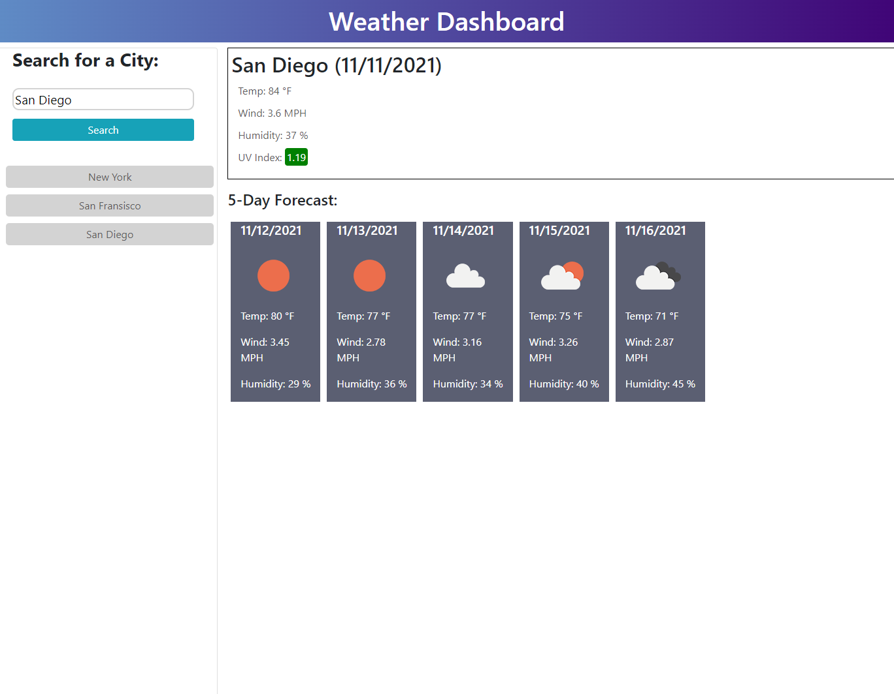

# Weather Dashboard

## Description
The Weather Dashboard application uses a weather API to display the current and forecasted weather of a city. Use the search bar to find a city of your choice. Search history is saved to local storage and displayed, if clicked the past search will re-display to the page. Weather Dashboard forecasts 5 days into the future and shows information for temperature, wind speed, humidity and weather icon. The UV index is also displayed for the current day with color.

## Website URL
https://ebtaterbug.github.io/weather-dashboard/

 
